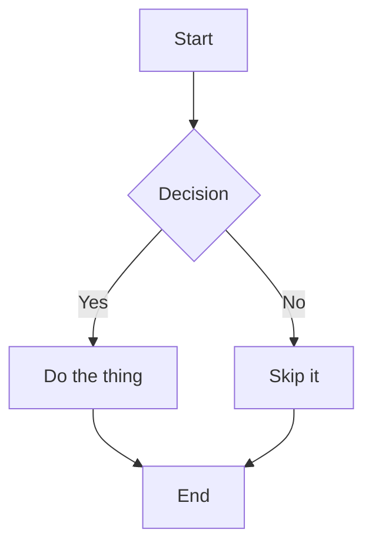

# Markdown PDF

Converts Markdown files to PDF or HTML from within VSCode. All rendering is local; no external servers, no telemetry, Chrome required.

## Requirements

Chrome or Chromium must be installed. The extension detects it automatically at standard installation paths on macOS, Linux, and Windows.

To use a non-standard Chrome binary:

```json
"markdown-pdf.executablePath": "/path/to/chrome"
```

Restart VSCode after changing this setting.

## What Changed in v2

This is a fork of [yzane/vscode-markdown-pdf](https://github.com/yzane/vscode-markdown-pdf), which had no maintainer activity since late 2023. See [CHANGELOG.md](CHANGELOG.md) for the full list of changes and [MIGRATION.md](MIGRATION.md) for upgrade instructions.

**Removed:** PlantUML (sent source to plantuml.com), PNG/JPEG export, Chromium auto-download, 10 settings.

**Added:** KaTeX math, DOMPurify sanitization (CVE-2024-7739), Mermaid async render fix, TypeScript rewrite, esbuild bundling (extension package: ~16MB, down from 60MB).

**Changed:** Default margins, highlight theme (github.css), header/footer off by default.

| Area | Detail |
|---|---|
| PlantUML | Removed; diagram source was sent to `plantuml.com` on each render. Use Mermaid instead. |
| PNG/JPEG export | Removed. PDF and HTML output only. |
| Chromium auto-download | Removed. The API (`createBrowserFetcher`) was dropped in puppeteer v20. |
| 10 settings | Removed or folded into fixed behavior. See [MIGRATION.md](MIGRATION.md). |

## Usage

### Command Palette

1. Open a Markdown file.
2. Press `F1` or `Ctrl+Shift+P`.
3. Type `export` and select a command:
   - `Markdown PDF: Export (pdf)`
   - `Markdown PDF: Export (html)`
   - `Markdown PDF: Export (all: pdf, html)`
   - `Markdown PDF: Export (settings.json)`

### Right-click Menu

1. Open a Markdown file.
2. Right-click in the editor.
3. Select a command from the `markdown-pdf` group.

### Auto-convert on Save

1. Add `"markdown-pdf.convertOnSave": true` to `settings.json`.
2. Restart VSCode.
3. Open a Markdown file. The extension converts it on each save.

To exclude specific files from auto-convert, add filename patterns to `markdown-pdf.convertOnSaveExclude`.

## Features

- Syntax highlighting via [highlight.js](https://highlightjs.org/) with 80+ themes
- Emoji support
- KaTeX math: `$...$` for inline, `$$...$$` for display
- Mermaid diagrams, rendered locally with no external calls
- File includes via [markdown-it-include](https://github.com/camelaissani/markdown-it-include)
- Custom div containers via [markdown-it-container](https://github.com/markdown-it/markdown-it-container)
- Checkbox and task list support via [markdown-it-checkbox](https://github.com/mcecot/markdown-it-checkbox)
- Footnotes via `[^1]` syntax
- DOMPurify sanitization of rendered HTML before PDF/HTML output

## Settings

### Output

| Setting | Default | Description |
|---|---|---|
| `markdown-pdf.type` | `["pdf"]` | Output formats. Accepts `pdf`, `html`, or both. |
| `markdown-pdf.convertOnSave` | `false` | Convert on save. Requires VSCode restart to take effect. |
| `markdown-pdf.convertOnSaveExclude` | `[]` | Filename patterns to skip during auto-convert. |
| `markdown-pdf.outputDirectory` | `""` | Directory for output files. Relative paths resolve from the workspace root. |
| `markdown-pdf.executablePath` | `""` | Path to a Chrome or Chromium binary. Leave empty to use auto-detection. |

### Styles

| Setting | Default | Description |
|---|---|---|
| `markdown-pdf.styles` | `[]` | Paths to additional CSS files. All `\` must be written as `\\` on Windows. |
| `markdown-pdf.highlight` | `true` | Enable syntax highlighting. |
| `markdown-pdf.highlightStyle` | `"github.css"` | highlight.js theme. See [highlight.js demo](https://highlightjs.org/static/demo/). |

### Markdown

| Setting | Default | Description |
|---|---|---|
| `markdown-pdf.breaks` | `false` | Treat newlines as `<br>` tags. |
| `markdown-pdf.emoji` | `true` | Render emoji shortcodes. |
| `markdown-pdf.math` | `true` | Enable KaTeX math rendering. |

### PDF

| Setting | Default | Description |
|---|---|---|
| `markdown-pdf.displayHeaderFooter` | `false` | Show header and footer in PDF output. |
| `markdown-pdf.headerTemplate` | *(title + date)* | HTML template for the PDF header. |
| `markdown-pdf.footerTemplate` | *(page / total)* | HTML template for the PDF footer. |
| `markdown-pdf.printBackground` | `true` | Print background graphics. |
| `markdown-pdf.orientation` | `"portrait"` | Page orientation: `portrait` or `landscape`. |
| `markdown-pdf.format` | `"A4"` | Paper size: Letter, Legal, Tabloid, Ledger, A0–A6. |
| `markdown-pdf.margin.top` | `"2cm"` | Top margin. Units: mm, cm, in, px. |
| `markdown-pdf.margin.bottom` | `"2cm"` | Bottom margin. Units: mm, cm, in, px. |
| `markdown-pdf.margin.right` | `"2.5cm"` | Right margin. Units: mm, cm, in, px. |
| `markdown-pdf.margin.left` | `"2.5cm"` | Left margin. Units: mm, cm, in, px. |

Header and footer templates support these tokens:

| Token | Value |
|---|---|
| `<span class='title'></span>` | Markdown filename |
| `<span class='pageNumber'></span>` | Current page number |
| `<span class='totalPages'></span>` | Total pages |
| `%%ISO-DATE%%` | Date in `YYYY-MM-DD` format |
| `%%ISO-DATETIME%%` | Date and time in `YYYY-MM-DD hh:mm:ss` format |
| `%%ISO-TIME%%` | Time in `hh:mm:ss` format |

## Mermaid Diagrams

Mermaid diagrams are rendered locally using the bundled `mermaid.min.js`. Before PDF capture, the extension waits for Mermaid's async SVG rendering to complete by polling for the `data-processed` attribute on each `.mermaid` element. This ensures diagrams appear in PDFs rather than as raw code blocks.

~~~markdown

~~~

PlantUML has been removed. It sent diagram source to `plantuml.com` on each render. For migration examples and equivalent Mermaid syntax, see [MIGRATION.md](MIGRATION.md).

## Custom Containers

The [markdown-it-container](https://github.com/markdown-it/markdown-it-container) plugin wraps content in named `<div>` elements. Style them with a custom CSS file.

Input:

```
::: warning
*here be dragons*
:::
```

Output:

```html
<div class="warning">
<p><em>here be dragons</em></p>
</div>
```

## File Includes

The [markdown-it-include](https://github.com/camelaissani/markdown-it-include) plugin inserts the contents of another Markdown file at the include site. Paths are relative to the file containing the include directive.

Syntax: `:[display text](relative-path-to-file.md)`

Example:

```
:[Plugins](./plugins/README.md)
:[Changelog](CHANGELOG.md)
```

The output contains the rendered content of each included file in sequence.

## Page Breaks

Insert a page break with:

```html
<div class="page"/>
```

## Known Limitations

- Chrome or Chromium must be installed separately. The extension does not bundle or download a browser.
- Online CSS URLs (e.g., `https://example.com/styles.css`) do not resolve reliably in PDF output. Prefer local stylesheet paths.

## Credits

This extension is a fork of [yzane/vscode-markdown-pdf](https://github.com/yzane/vscode-markdown-pdf).

Libraries:

- [puppeteer/puppeteer](https://github.com/puppeteer/puppeteer)
- [markdown-it/markdown-it](https://github.com/markdown-it/markdown-it)
- [mcecot/markdown-it-checkbox](https://github.com/mcecot/markdown-it-checkbox)
- [valeriangalliat/markdown-it-anchor](https://github.com/valeriangalliat/markdown-it-anchor)
- [markdown-it/markdown-it-emoji](https://github.com/markdown-it/markdown-it-emoji)
- [isagalaev/highlight.js](https://github.com/isagalaev/highlight.js)
- [cheeriojs/cheerio](https://github.com/cheeriojs/cheerio)
- [janl/mustache.js](https://github.com/janl/mustache.js)
- [markdown-it/markdown-it-container](https://github.com/markdown-it/markdown-it-container)
- [camelaissani/markdown-it-include](https://github.com/camelaissani/markdown-it-include)
- [mermaid-js/mermaid](https://github.com/mermaid-js/mermaid)
- [KaTeX/KaTeX](https://github.com/KaTeX/KaTeX)
- [cure53/DOMPurify](https://github.com/cure53/DOMPurify)
- [jonschlinkert/gray-matter](https://github.com/jonschlinkert/gray-matter)

and

- [cakebake/markdown-themeable-pdf](https://github.com/cakebake/markdown-themeable-pdf)

## License

MIT
