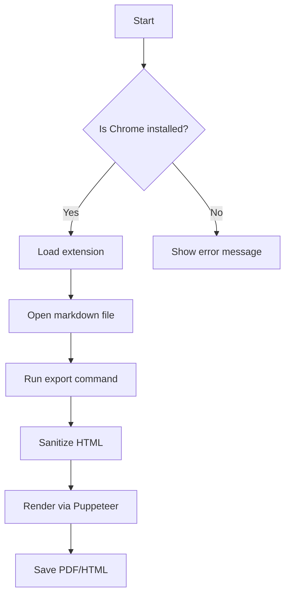
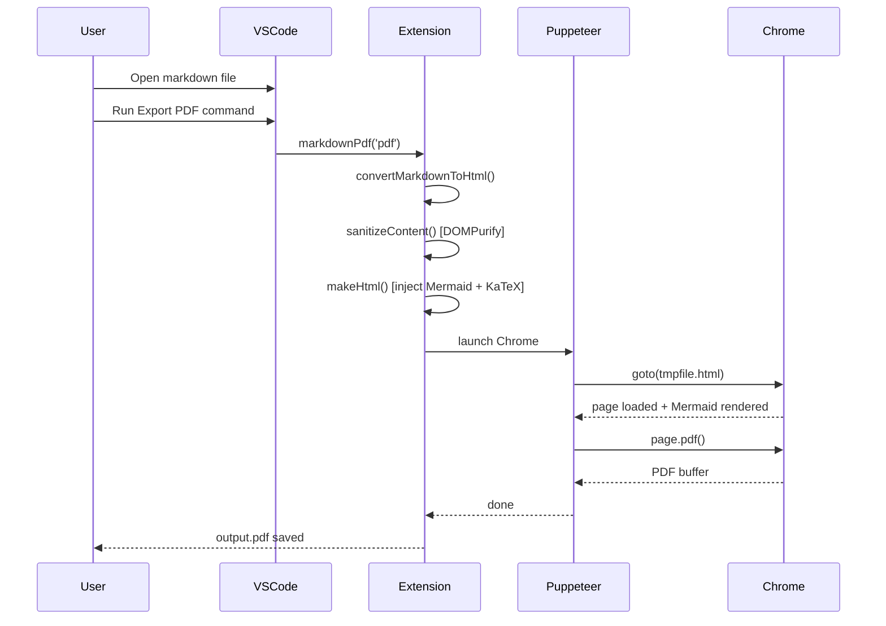
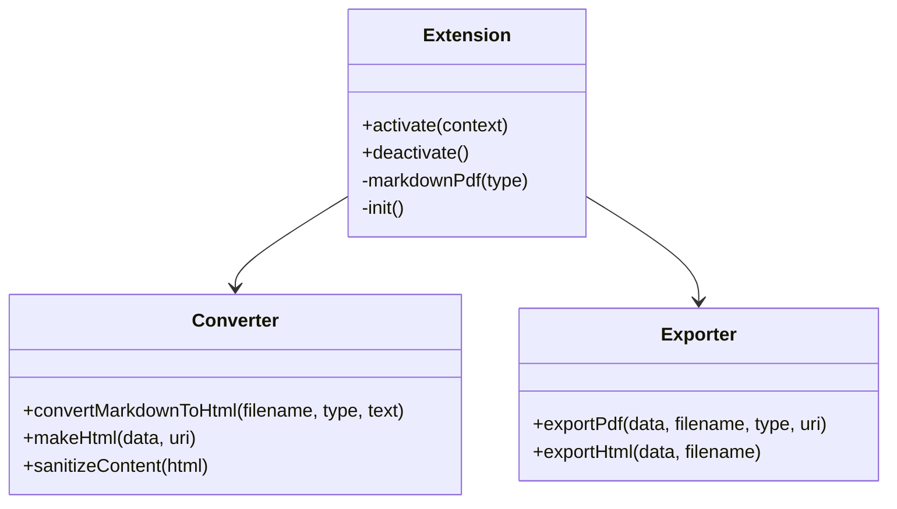
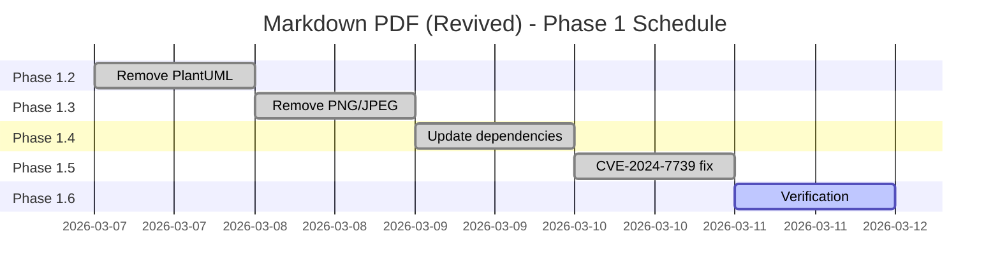
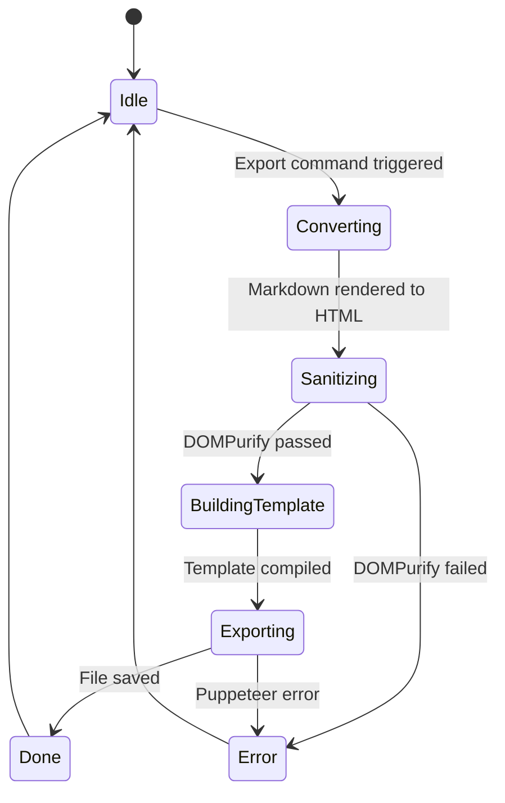

# Mermaid Diagrams Test

Mermaid renders locally from bundled node_modules — no CDN, no internet required.

## Flowchart

## Sequence Diagram

## Class Diagram

## Gantt Chart

## State Diagram

